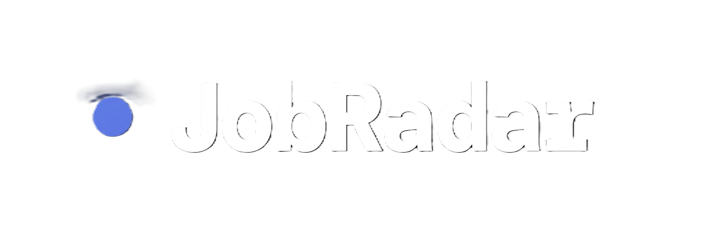
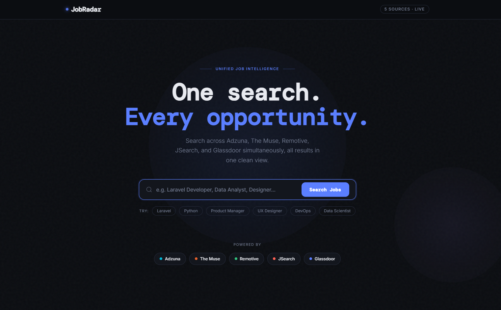
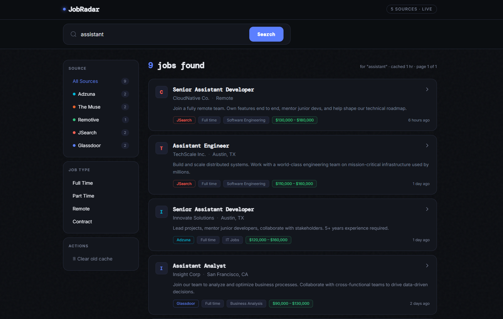
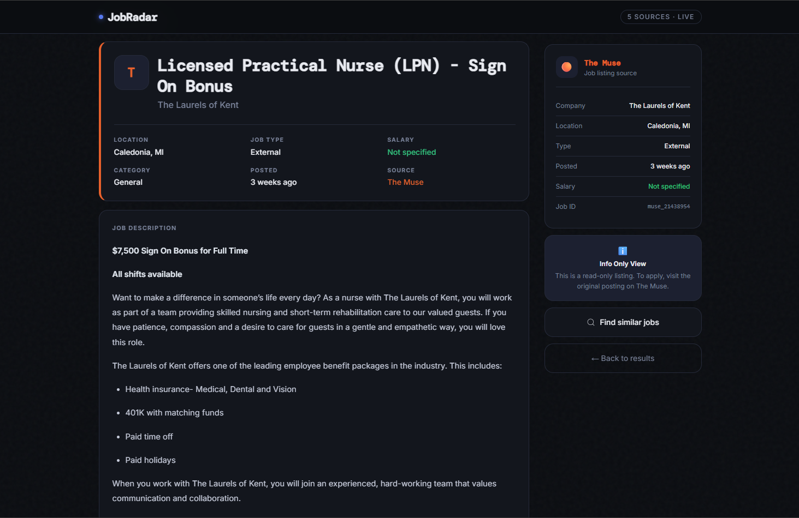
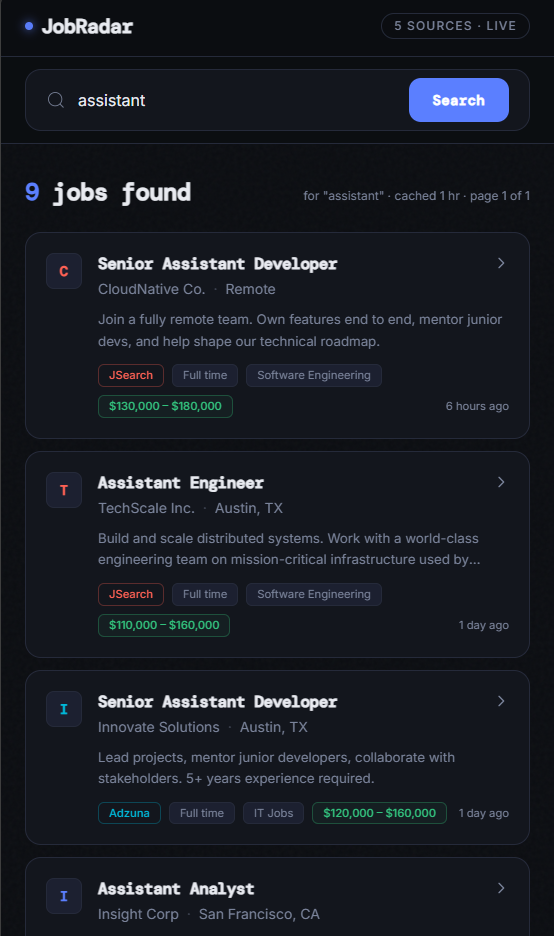

<p align="center">
  
</p>

<p align="center">
  <strong>One search. Every opportunity.</strong><br>
  A unified job search aggregator that pulls listings from 5+ job boards into a single, elegant interface.
</p>

<p align="center">
  
  
  
  
  
</p>

---


## About

**JobRadar** is a real-time job search aggregator built with Laravel and Livewire. Instead of checking multiple job boards separately, JobRadar fetches, normalizes, and displays listings from Adzuna, The Muse, Remotive, JSearch, and Glassdoor — all in one place with a fast, reactive interface.

Built as a portfolio project to demonstrate full-stack Laravel skills including API integration, intelligent caching, reactive UI with Livewire, and clean service-oriented architecture.

## Features

- **Multi-Source Aggregation** — Search across 5+ job APIs simultaneously with unified results
- **Smart 3-Tier Caching** — Laravel cache (30 min) → Database cache (60 min) → Live API fallback
- **Real-Time Filtering** — Filter by job source, job type (Full Time, Part Time, Remote, Contract)
- **Reactive UI** — Powered by Livewire with no full page reloads
- **Shareable URLs** — Search state persisted via query parameters (`?q=laravel&source=adzuna&type=remote`)
- **Job Detail Pages** — Full descriptions, salary ranges, company info, and direct links to original postings
- **Deduplication** — Automatic removal of duplicate listings across sources
- **Graceful Fallback** — Mock data returned when API keys are missing, so the app always works
- **Dark Theme** — Modern dark UI with custom color palette and ambient gradient effects
- **Responsive Design** — Mobile-first layout with collapsible sidebar filters

## Screenshots

| Landing Page | Search Results |
|:---:|:---:|
|  |  |

| Job Detail Page | Mobile View |
|:---:|:---:|
|  |  |

## Architecture

```
┌─────────────────────────────────────────────────────┐
│                   User Interface                     │
│            Livewire JobSearch Component               │
│         (search, filter, paginate, quick tags)        │
└──────────────────────┬──────────────────────────────┘
                       │
┌──────────────────────▼──────────────────────────────┐
│              JobAggregatorService                     │
│         (orchestration, caching, dedup)               │
└──────────────────────┬──────────────────────────────┘
                       │
        ┌──────────────┼──────────────┐
        │              │              │
   ┌────▼────┐   ┌────▼────┐   ┌────▼────┐
   │ Laravel  │   │Database │   │  Live   │
   │  Cache   │   │  Cache  │   │  APIs   │
   │ (30 min) │   │ (60 min)│   │         │
   └──────────┘   └─────────┘   └────┬────┘
                                     │
                    ┌────────────────┬┴───────────────┐
                    │                │                 │
              ┌─────▼─────┐  ┌──────▼──────┐  ┌──────▼──────┐
              │  Adzuna    │  │  The Muse   │  │  Remotive   │
              │  Service   │  │  Service    │  │  Service    │
              └────────────┘  └─────────────┘  └─────────────┘
              ┌─────▼─────┐  ┌──────▼──────┐
              │  JSearch   │  │  Glassdoor  │
              │  Service   │  │  Service    │
              └────────────┘  └─────────────┘
```

Each service normalizes API responses into a consistent schema:

```php
[
    'external_id', 'source', 'title', 'company', 'location',
    'description', 'salary_min', 'salary_max', 'salary_currency',
    'job_type', 'category', 'tags', 'posted_at', 'external_url', 'logo_url'
]
```

## Tech Stack

| Layer | Technology |
|-------|-----------|
| **Backend** | Laravel 13, PHP 8.3+ |
| **Frontend** | Livewire 4.2, Tailwind CSS 4.2 |
| **Build** | Vite 8 |
| **Caching** | Redis (Predis) + Database |
| **Database** | SQLite (default) / MySQL / PostgreSQL |
| **Testing** | PHPUnit 12 |

### API Integrations

| Source | Auth | Notes |
|--------|------|-------|
| **Adzuna** | App ID + Key | Global job search, region-based |
| **The Muse** | API Key | Tech & creative industry jobs |
| **Remotive** | None | Remote-only jobs, public API |
| **JSearch** | RapidAPI Key | Broad job search via RapidAPI |
| **Glassdoor** | RapidAPI Key | Company-level job data via RapidAPI |

## Getting Started

### Prerequisites

- PHP 8.3+
- Composer
- Node.js & npm
- Redis (optional, falls back to file cache)

### Installation

```bash
# Clone the repository
git clone https://github.com/cuncis/jobradar.git
cd jobradar

# Install dependencies
composer install
npm install

# Environment setup
cp .env.example .env
php artisan key:generate

# Database
touch database/database.sqlite
php artisan migrate

# Build frontend assets
npm run build

# Start the development server
php artisan serve
```

### API Keys

Add your API keys to `.env`. **All keys are optional** — services gracefully fall back to mock data when keys are missing.

```env
# Adzuna (https://developer.adzuna.com)
ADZUNA_APP_ID=your_app_id
ADZUNA_APP_KEY=your_app_key
ADZUNA_COUNTRY=us

# The Muse (https://www.themuse.com/developers)
THEMUSE_API_KEY=your_key

# JSearch via RapidAPI (https://rapidapi.com/letscrape-6bRBa3QguO5/api/jsearch)
JSEARCH_API_KEY=your_rapidapi_key

# Glassdoor via RapidAPI
GLASSDOOR_API_KEY=your_rapidapi_key
```

### Development

```bash
# Run Vite dev server with HMR
npm run dev

# Run Laravel dev server
php artisan serve

# Run tests
php artisan test
```

## Project Structure

```
app/
├── Livewire/
│   └── JobSearch.php          # Main search component (search, filter, paginate)
├── Models/
│   └── CachedJob.php          # Eloquent model for cached job listings
├── Services/
│   ├── JobAggregatorService   # Orchestrates all APIs, caching & dedup
│   ├── AdzunaService          # Adzuna API integration
│   ├── TheMuseService         # The Muse API integration
│   ├── RemotiveService        # Remotive API integration
│   ├── JSearchService         # JSearch (RapidAPI) integration
│   └── GlassdoorService       # Glassdoor (RapidAPI) integration
resources/views/
├── livewire/
│   └── job-search.blade.php   # Reactive search UI (hero + results)
├── jobs/
│   └── show.blade.php         # Job detail page
└── layouts/
    └── app.blade.php          # Base layout
```

## Key Design Decisions

- **Service Pattern** — Each job API has its own service class with a consistent interface, making it easy to add new sources
- **3-Tier Caching** — Minimizes API calls while keeping data fresh; database acts as a persistent fallback layer
- **Mock Data Fallback** — Every service returns realistic mock data when API keys are missing, enabling local development without credentials
- **Normalized Schema** — All API responses are transformed to a unified format, so the UI doesn't care which source a job came from
- **Query-Scoped Caching** — Jobs are cached per search query with a composite unique key `(external_id, source, search_query)`

## License

This project is open-sourced software licensed under the [MIT License](https://opensource.org/licenses/MIT).
